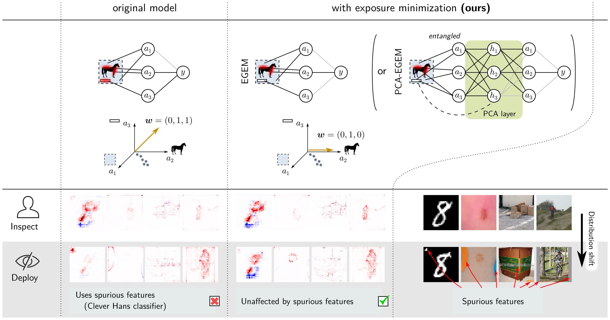

# EGEM: Explanation-Guided Exposure Minimization

Code for L. Linhardt, K.-R. Müller, G. Montavon,
[*Preemptively Pruning Clever-Hans Strategies in Deep Neural Networks*](https://arxiv.org/abs/2304.05727),
Information Fusion, 2024.

EGEM soft-prunes a trained network so that it keeps only the variation that the user has
validated on a small set of clean, correctly explained samples. Clever-Hans (CH) strategies that the
user never saw lose their influence. PCA-EGEM does the same in a PCA basis of each layer's
activations.



## Install

```bash
conda create -n egem python=3.10
conda activate egem
pip install -r src/requirements.txt
```

## Data

All scripts default to `~/EGEM_work/data` (change it with `--data_root` / `--root` / `--out`).

| Dataset | How to get it | Location |
|---|---|---|
| MNIST | downloaded automatically | `~/EGEM_work/data/MNIST` |
| ISIC 2019 | `ISIC_2019_Training_Input.zip` and `ISIC_2019_Training_GroundTruth.csv` from `https://isic-challenge-data.s3.amazonaws.com/2019/`, unzipped | `~/EGEM_work/data/isic` |
| ImageNet (6 classes) | `repro/fetch_imagenet_subset.py`, from the gated Hugging Face dataset `ILSVRC/imagenet-1k` (request access, then `huggingface-cli login`) | `~/EGEM_work/data/imagenet` |
| CelebA | `torchvision.datasets.CelebA(root, download=True)` (needs `gdown`) | `~/EGEM_work/data/celeba_root` |

```bash
# ISIC 2019 (~10 GB download, 16 GB unpacked)
mkdir -p ~/EGEM_work/data/isic && cd ~/EGEM_work/data/isic
B=https://isic-challenge-data.s3.amazonaws.com/2019
curl -O $B/ISIC_2019_Training_GroundTruth.csv -O $B/ISIC_2019_Training_Input.zip && unzip -q ISIC_2019_Training_Input.zip
cd -

# ImageNet: keeps only the six classes (~2.7 GB); streams the ~155 GB of shards one at a time
python repro/fetch_imagenet_subset.py --tmp <scratch dir>        # or: sbatch repro/fetch_imagenet_subset.sbatch

# CelebA
python -c "import torchvision; torchvision.datasets.CelebA('$HOME/EGEM_work/data/celeba_root', download=True)"
```

## Models

- MNIST, MNIST variants and CelebA: `model_weights/` (in the repo).
- ImageNet: torchvision's pretrained ResNet-50 and VGG-16 (downloaded automatically).
- ISIC: fine-tune VGG-16 once (writes `model_weights/isic_vgg16.model`):

  ```bash
  python repro/train_isic.py --build_cache       # decode the images once (CPU)
  python repro/train_isic.py                     # train on a GPU, ~20 min; or: sbatch repro/train_isic.sbatch
  ```

## Quick start

Run from the repository root:

```bash
python src/run.py --scenario_name mnist-8 --data_root ~/EGEM_work/data --refinement pcaegem \
    --poisoning_strategy uniform --n_samples 700 --n_reps 5
```

- `--refinement`: `none` (the original model), `egem`, `pcaegem`, and the baselines `retrain`, `ridge`
  and `rgem`.
- `--poisoning_strategy`: how the test set is modified. `none` gives clean data; `uniform` adds the CH
  artifact to every class.
- Scenarios: `mnist-8`, `mnist-rgb-{artifact,blur,color,remove}`, `isic-1`, `carton-{crate,envelope,packet}`,
  `mtb-bbt`.

Each run evaluates the whole hyperparameter grid and saves every result to `results/`. Refinement and
validation samples are images the model classifies correctly (`--all_samples` to use all). The run prints
the value chosen by slack-based selection: the strongest refinement whose validation accuracy is at least
`1 - slack` (default 5%) times that of the original model (`src/selection.py`).

## Reproducing the experiments

`repro/run_scenario.py` runs one scenario × method × test poisoning and writes a compact result file to
`repro/results/`. Every accuracy experiment is a loop over it:

```bash
M="none retrain ridge rgem egem pcaegem"
# accuracy per method (700 samples/class, 5 reps); ISIC and ImageNet need a GPU
for sc in mnist-8 isic-1 carton-crate carton-envelope carton-packet mtb-bbt; do
  root=~/EGEM_work/data; [ $sc = isic-1 ] && root=$root/isic; [[ $sc == carton* || $sc == mtb* ]] && root=$root/imagenet
  for m in $M; do for p in none uniform; do
    python repro/run_scenario.py --scenario $sc --data_root $root --refinement $m --poisoning $p
  done; done
done
# number of refinement samples: add --n_samples {25,50,200,500}
# MNIST CH-feature variants: --scenario mnist-rgb-{artifact,blur,color,remove} --n_samples 50 --n_reps 10
# outputs for the logit-change plot: add --save_outputs to the 700-sample runs
```

On Slurm, `sbatch repro/run_gpu.sbatch <run_scenario.py arguments>` runs one experiment and
`sbatch repro/run_list.sbatch <file>` runs a file of argument lines one after another. The scripts use this
cluster's partition and resource names; adapt them to yours.

Further analyses, each a single script:

| Script | Computes |
|---|---|
| `repro/celeba_recall.py` | CelebA blond-hair precision/recall per attribute subgroup, LRP heatmaps, wall occlusion, attribute correlations (GPU) |
| `repro/layer_separability.py` | separability of clean vs. poisoned images at every layer |
| `repro/ch_sparsity.py` | sparsity of the representation change caused by each MNIST CH feature |

Plots and tables:

```bash
python repro/analyze.py --scenario isic-1 --n 700 --slack 0.05    # selected test accuracy per method
python repro/analyze.py --export repro/results/all_runs.csv       # every run as one table
python repro/make_figures.py                                      # all plots into repro/figures/
```

| Figure | Paper |
|---|---|
| `accuracy_main.png` | Fig. 3 |
| `accuracy_vs_slack_<method>.png` | Fig. 4 (PCA-EGEM), Fig. G.13 |
| `accuracy_vs_samples_<method>.png` | Fig. 5 (PCA-EGEM), Fig. H.15 |
| `accuracy_mnist_variants.png` | Fig. 6 |
| `ch_sparsity.png` | Fig. 7 |
| `celeba_heatmaps.png`, `celeba_recall.png` | Figs. 8, 9 |
| `celeba_precision_recall.png`, `celeba_wall.png`, `celeba_attr_corr.png` | Figs. I.17, I.18, C.11 |
| `layer_separability.png`, `logit_change.png` | Figs. J.19, J.20 |

## Layout

| Path | Content |
|---|---|
| `src/refinement/refiner.py` | EGEM / PCA-EGEM and the baselines (Retrain, Ridge, RGEM, ...) |
| `src/run.py`, `src/experiment_config.py` | experiment runner and per-scenario configuration (layers, grids) |
| `src/CH_datasets/` | vendored CH benchmark tasks (poisoners, splits) |
| `src/selection.py` | slack-based hyperparameter selection |
| `model_weights/` | MNIST and CelebA models (the ISIC model is trained with `repro/train_isic.py`) |
| `repro/` | experiment drivers, analysis and plotting scripts, results and figures |

## Citation

```bibtex
@article{linhardt2024preemptively,
  title   = {Preemptively Pruning Clever-Hans Strategies in Deep Neural Networks},
  author  = {Linhardt, Lorenz and M{\"u}ller, Klaus-Robert and Montavon, Gr{\'e}goire},
  journal = {Information Fusion},
  year    = {2024}
}
```
